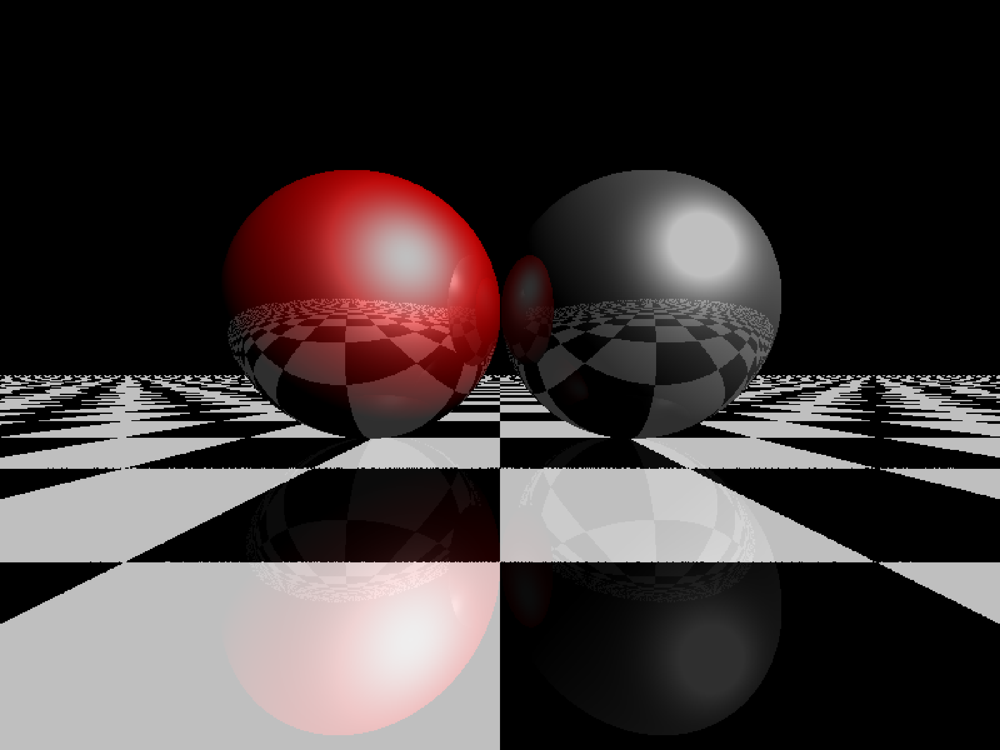

# ray-tracing-renderer
A renderer based on ray tracing by C++

这是一个用C++语言编写的，基于ray-trace的渲染器

输出格式采用tga图片输出，但由于Markdown不支持tga文件，所以下面的展示都用png图片。

本文主要参考MiloYip大大的两篇博客：[用JavaScript玩转计算机图形学(一)光线追踪入门](https://www.cnblogs.com/miloyip/archive/2010/03/29/1698953.html)，[用JavaScript玩转计算机图形学(二)基本光源](https://www.cnblogs.com/miloyip/archive/2010/04/02/1702768.html)。自己加了少量的改动。

1. 渲染法线

2. 渲染深度

3. 直射光+阴影

4. 点光源+阴影

   

5. 三原色聚光灯

6. 反射+材质

7. 聚光灯+反射+材质+阴影

   

8. 多个点光源测试

